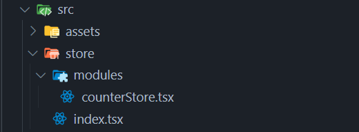

## 安装依赖

redux-toolkit:  包含了 Redux 核心，以及我们认为对于构建 Redux 应用程序必不可少的其他关键软件包

react-redux： 连接react组件与redux中的状态

```typescript
pnpm add @reduxjs/toolkit
pnpm add react-redux
```


## 初始化Store目录结构




## React连接Redux

### main.tsx

```typescript
import store from "./store";
import { Provider } from "react-redux";
createRoot(document.getElementById("root")!).render(
  <StrictMode>
    <Provider store={store}>
      <App />
    </Provider>
  </StrictMode>
);
```

## 配置counterStore

### counterStore.tsx

```typescript
import { createSlice } from "@reduxjs/toolkit";

const counterStore = createSlice({
  name: "counter",
  initialState: {
    count: 0,
  },
  reducers: {
    increment: (state) => {
      state.count++;
    },
    decrement: (state) => {
      state.count--;
    },
  },
});

const { increment, decrement } = counterStore.actions;
const countReducer = counterStore.reducer;

export { increment, decrement };
export default countReducer;
```

### index.tsx

```typescript
import { configureStore } from "@reduxjs/toolkit";
import countReducer from "./modules/counterStore";

const store = configureStore({
  reducer: {
    counter: countReducer,
  },
});

export default store;
```

## 消费Store中的数据

### App.tsx

```typescript
import { useSelector } from "react-redux";
const { count } = useSelector((state: any) => state.counter);
<p>{count}</p>
```

## 更新Store中的数据
### App.tsx

```typescript
import { useDispatch } from "react-redux";\
const dispatch = useDispatch();

import { increment, decrement } from "./store/modules/counterStore";
<button onClick={() => dispatch(decrement())}>-</button>
<button onClick={() => dispatch(increment())}>+</button>
```


## 传参更新Store中的数据
### counterStore.tsx

```typescript
import { createSlice } from "@reduxjs/toolkit";

const counterStore = createSlice({
  name: "counter",
  initialState: {
    count: 0,
  },
  reducers: {
    increment: (state) => {
      state.count++;
    },
    decrement: (state) => {
      state.count--;
    },
    addTen: (state, action) => {
      state.count += action.payload;
    },
  },
});

const { increment, decrement, addTen } = counterStore.actions;
const countReducer = counterStore.reducer;

export { increment, decrement, addTen };
export default countReducer;
```

### App.tsx

```typescript
import { addTen } from "./store/modules/counterStore";
<button onClick={() => dispatch(addTen(10))}>+10</button>
```

## 异步更新Store中的数据
### channelStore.tsx

```typescript
import { createSlice } from "@reduxjs/toolkit";
import axios from "axios";
import { Todo } from "../../types";

const channelStore = createSlice({
  name: "channel",
  initialState: {
    channelList: [],
  },
  reducers: {
    setChannelList(state, action) {
      state.channelList = action.payload;
    },
  },
});

const { setChannelList } = channelStore.actions;
const channelReducer = channelStore.reducer;

const fetchChannelList = () => {
  return async (
    dispatch: (action: { type: string; payload: Todo[] }) => void
  ) => {
    const res = await axios.get<Todo[]>(
      "https://jsonplaceholder.typicode.com/todos"
    );
    console.log("res", res);
    dispatch(setChannelList(res.data));
  };
};

export { fetchChannelList };
export default channelReducer;

```

### app.tsx

```typescript
import { useSelector, useDispatch } from "react-redux";
import { increment, decrement, addTen } from "./store/modules/counterStore";
import { fetchChannelList } from "./store/modules/channelStore";
import { useEffect } from "react";

import { Todo } from "../src/types";
function App() {
  const { count } = useSelector((state: any) => state.counter);
  const { channelList } = useSelector((state: any) => state.channel);
  console.log("channelList", channelList);
  const dispatch = useDispatch();
  console.log("channelList", channelList);
  useEffect(() => {
    dispatch(fetchChannelList());
  }, [dispatch]);
  return (
    <>
      <h3>App page</h3>
      <p>{count}</p>
      <button onClick={() => dispatch(decrement())}>-</button>
      <button onClick={() => dispatch(increment())}>+</button>
      <button onClick={() => dispatch(addTen(10))}>+10</button>
      <ul>
        {channelList.map((item: any) => (
          <>
            <li key={item.userId}>{item.title}</li>
          </>
        ))}
      </ul>
    </>
  );
}

export default App;

```

